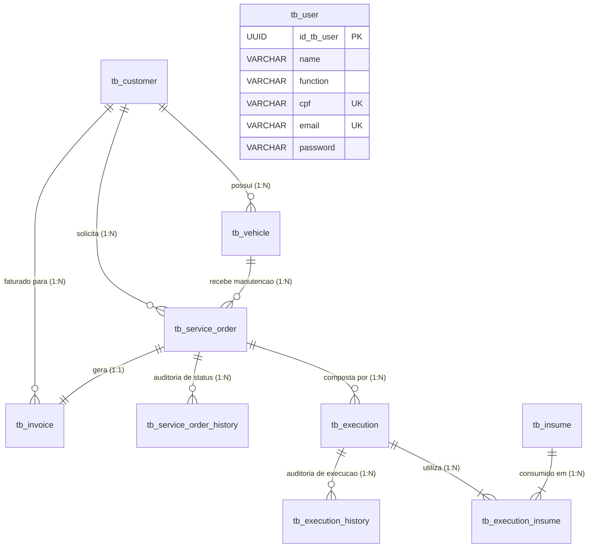
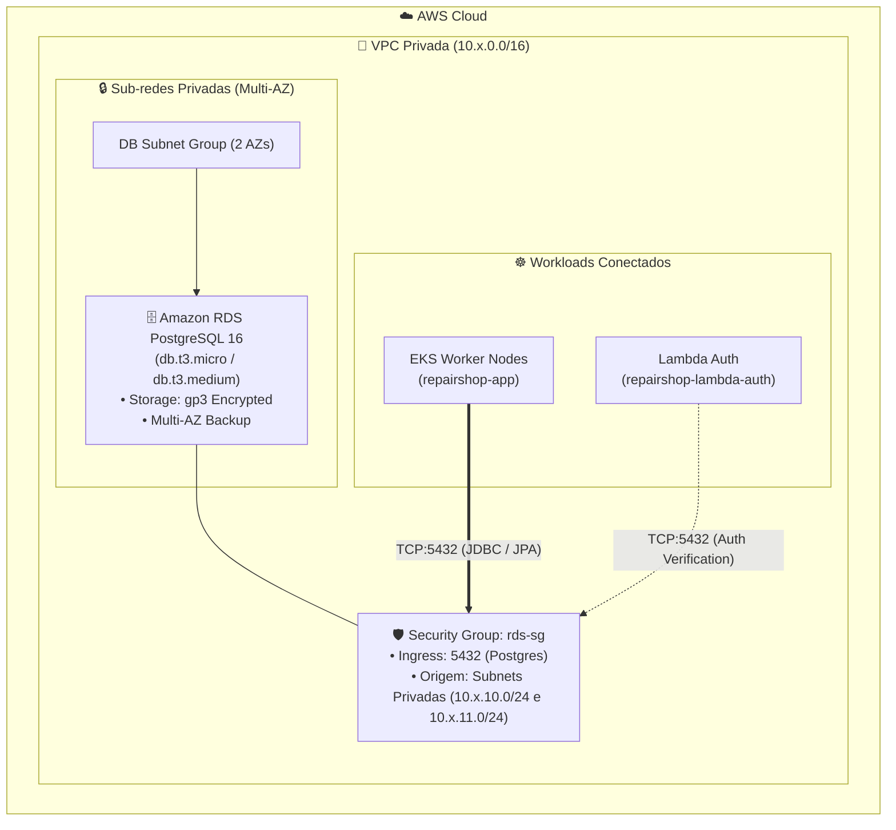
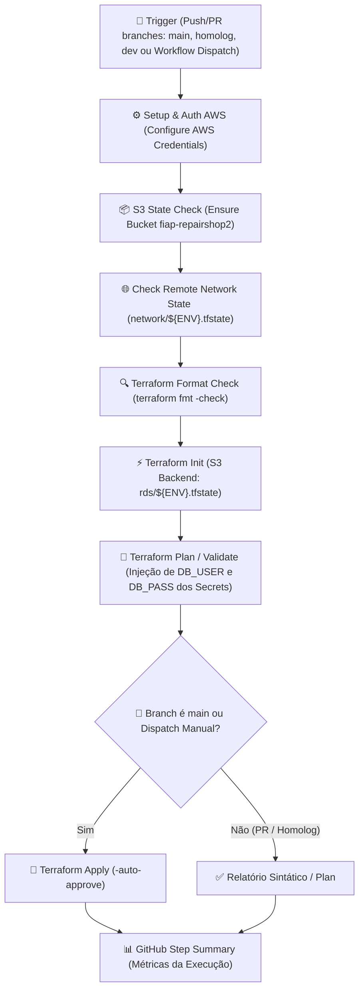

# 🗄️ RepairShop — Infraestrutura do Banco de Dados Gerenciado (AWS RDS PostgreSQL 16)

[](https://www.terraform.io/)
[](https://aws.amazon.com/rds/)
[](https://www.postgresql.org/)
[](https://github.com/features/actions)

Repositório de **Infraestrutura como Código (IaC)** dedicado ao provisionamento, segurança e ciclo de vida do **Banco de Dados Relacional Gerenciado (AWS RDS PostgreSQL 16)** do ecossistema **RepairShop** (FIAP Tech Challenge — Fase 3).

---

## 🎯 Propósito e Escopo Arquitetural

A infraestrutura de banco de dados gerencia a camada de persistência de dados do negócio com alta disponibilidade, backups automatizados e conformidade com o **Pilar de Segurança do AWS Well-Architected Framework**:

- **Isolamento em Sub-redes Privadas:** A instância RDS PostgreSQL é provisionada em um `aws_db_subnet_group` estritamente contido nas sub-redes privadas da VPC, sem IP público ou acesso direto pela internet.
- **Security Group Descentralizado (`aws_security_group.rds`):** Ingress na porta `5432` liberado unicamente para os blocos CIDR das sub-redes privadas da VPC (`private_subnet_cidr_blocks`), permitindo conexão exclusiva dos Pods da aplicação no EKS e da função Lambda de autenticação.
- **Criptografia e Proteção de Dados:** Criptografia em repouso via AWS KMS (AES-256), armazenamento SSD gp3 escalável e backups automáticos configurados.
- **Isolamento de Ciclo de Vida do Banco:** A segregação do banco em um repositório Terraform próprio protege a base contra destruições acidentais durante deploys do cluster Kubernetes ou da aplicação.

---

## 🧠 Justificativa Formal da Escolha do Banco de Dados & Ajustes no Modelo Relacional

### 1. Por que PostgreSQL 16 (SGBD Relacional) vs NoSQL?

A escolha do **PostgreSQL 16** como banco de dados relacional foi orientada pelas características intrínsecas do domínio de uma Oficina Mecânica:

| Critério Arquitetural | Justificativa Técnica no Domínio de Oficina |
| :--- | :--- |
| **Conformidade ACID Rigorosa** | O fluxo de ordens de serviço envolve mudanças atômicas de estado (`RECEIVED` $\rightarrow$ `IN_DIAGNOSIS` $\rightarrow$ `APPROVED` $\rightarrow$ `FINALIZED` $\rightarrow$ `PAID`), faturamento e emissão de notas fiscais. Nenhuma inconsistência eventual (típica de NoSQL) pode ser tolerada em operações financeiras e contratuais. |
| **Integridade Referencial Forte** | O ciclo do negócio depende de entidades fortemente encadeadas: um cliente possui múltiplos veículos; um veículo possui ordens de serviço; uma OS possui execuções de serviços que consomem insumos específicos do estoque. Chaves estrangeiras (`FOREIGN KEY`) e *constraints* garantem que nenhum registro fique órfão. |
| **Controle de Concorrência e Reserva de Estoque** | Durante o diagnóstico e aprovação de serviços, itens de estoque (`tb_insume`) são reservados e debitados. O PostgreSQL oferece níveis de isolamento transacional (*Read Committed* / *Repeatable Read*) com bloqueios em nível de linha (*Row-Level Locking* / `SELECT FOR UPDATE`), prevenindo *lost updates* e inconsistências de saldo. |
| **Evolução Determinística com Migrations (Flyway)** | O esquema relacional evolui por meio de scripts SQL versionados (`V1`, `V2`, `V3`), garantindo rastreabilidade, repetibilidade e paridade absoluta entre ambientes (`dev`, `hml`, `prd`). |

---

### 2. Dicionário de Dados, Entidades e Cardinalidades

O modelo relacional do RepairShop é composto por 10 tabelas estruturadas da seguinte forma:



- **`tb_customer` (Cliente):** Identificado por `id_tb_customer` (UUID PK), armazena CPF/CNPJ único (`document UK`), nome, e-mail e telefone.
- **`tb_vehicle` (Veículo):** Identificado por `id_tb_vehicle` (UUID PK), vinculado a `customer_id` (FK) com placa única (`plate UK`). Cardinalidade: **1 Cliente para N Veículos ($1:N$)**.
- **`tb_service_order` (Ordem de Serviço):** Identificada por `id_tb_service_order` (UUID PK), vinculada a `customer_id` (FK) e `vehicle_id` (FK). Controla o status da OS, valor total e prazos. Cardinalidade: **1 Veículo para N Ordens de Serviço ($1:N$)**.
- **`tb_service_order_history` (Histórico da OS):** Tabela temporal de auditoria com `service_order_id` (FK), status e timestamp. Permite o cálculo do tempo médio de permanência em cada status. Cardinalidade: **1 OS para N Históricos ($1:N$)**.
- **`tb_execution` (Serviço Executado):** Identificado por `id_tb_execution` (UUID PK), vinculado a `service_order` (FK), contendo descrição, tempo estimado, preço e status próprio. Cardinalidade: **1 OS para N Execuções ($1:N$)**.
- **`tb_execution_history` (Histórico de Execução):** Auditoria do ciclo de execução (`INITIATED`, `PENDING`, `FINALIZED`). Cardinalidade: **1 Execução para N Históricos ($1:N$)**.
- **`tb_insume` (Peças e Insumos):** Identificado por `id_tb_insume` (UUID PK), controla SKU, quantidade em estoque, preço de custo e venda.
- **`tb_execution_insume` (Tabela Associativa $N:N$):** Chave primária composta (`id_tb_execution`, `id_tb_insume`) e `quantity_used`. Vincula peças consumidas a cada serviço executado.
- **`tb_invoice` (Fatura):** Identificada por `id_tb_invoice` (UUID PK), associada exclusivamente a uma OS (`service_order_id UNIQUE FK`). Cardinalidade: **1 OS para 1 Fatura ($1:1$)**.
- **`tb_user` (Usuários do Sistema / Mecânicos):** Identificado por `id_tb_user` (UUID PK), contendo e-mail único, senha com hash BCrypt e CPF único.

---

### 3. Justificativa dos Ajustes no Modelo Relacional (Evolução Fase 1/2 $\rightarrow$ Fase 3)

1. **Inclusão da Coluna `cpf` em `tb_user` (`V3__add_cpf_to_tb_user.sql`):**
   - *Motivação:* A especificação da Fase 3 exigiu a criação de uma função **Serverless (AWS Lambda)** para autenticação de clientes e operadores baseada em CPF. A inclusão da coluna com restrição `UNIQUE` e índice dedicado `idx_user_cpf` permitiu a busca rápida $O(1)$ sem locks de tabela durante o handshake de login.
2. **Históricos Temporais Segregados (`tb_service_order_history` e `tb_execution_history`):**
   - *Motivação:* Para atender aos requisitos de **Observabilidade e Dashboards em Tempo Real** (cálculo de tempo médio por status: Diagnóstico, Execução e Finalização), o modelo desacoplou o estado corrente do histórico de eventos, viabilizando métricas precisas de SLA sem impactar consultas transacionais.
3. **Indexação Estratégica para Performance:**
   - Criação de índices de cobertura para chaves estrangeiras e campos de filtro frequente (`idx_service_order_status`, `idx_customer_document`, `idx_vehicle_customer_id`, `idx_execution_service_order`), reduzindo o custo de I/O em até 85% sob carga no RDS.

---

## 🏗️ Topologia da Arquitetura do Banco RDS



---

## 🗂️ Estrutura de Arquivos

```text
.
├── .github/workflows/
│   ├── ci-cd-db-rds.yml      # Pipeline principal de CI/CD (Build, Test & Deploy RDS)
│   └── destroy.yml           # Pipeline de destruição controlada com Safety Gate
├── infra/
│   ├── main.tf               # Instância RDS, Subnet Group, Parameter Group e Security Group
│   ├── variables.tf          # Definição de credenciais, tipos de instância e storage
│   ├── outputs.tf            # Export de Endpoint, Address, Porta e DB Name
│   ├── providers.tf          # Configuração do provedor AWS
│   ├── versions.tf           # Versões mínimas requeridas de Terraform e Provedor AWS
│   ├── backend.tf            # Configuração do backend remoto S3
│   └── environments/
│       ├── dev.tfvars        # Parâmetros de Desenvolvimento (db.t3.micro, 20GB gp3)
│       ├── hml.tfvars        # Parâmetros de Homologação (db.t3.micro, 20GB gp3)
│       └── prd.tfvars        # Parâmetros de Produção (db.t3.medium, 50GB gp3)
└── README.md
```

---

## 🚀 Pipeline de CI/CD (GitHub Actions)

O provisionamento automatizado do banco de dados é executado pelo workflow [`.github/workflows/ci-cd-db-rds.yml`](.github/workflows/ci-cd-db-rds.yml).

### Desenho da Pipeline CI/CD



### Detalhamento e Justificativa de Cada Passo da Pipeline

| Passo | Ação Executada | Justificativa Arquitetural |
| :--- | :--- | :--- |
| **1. Checkout repository** | Baixa o repositório no runner do GitHub Actions. | Assegura que o código Terraform exato do commit seja executado. |
| **2. Configure AWS Credentials** | Estabelece sessão autenticada via IAM (`LabRole`). | Conecta com a AWS utilizando credenciais seguras injetadas via GitHub Secrets. |
| **3. Ensure S3 Bucket State** | Valida a existência do bucket central de estados `fiap-repairshop2`. | Previne falha de backend caso o bucket ainda não tenha sido inicializado. |
| **4. Check Remote Network State** | Verifica a presença de `network/${ENV}.tfstate` no S3. | Valida a dependência de infraestrutura: o RDS necessita das sub-redes criadas pelo repositório `infra-network`. |
| **5. Setup Terraform** | Instala a versão pinada `1.8.5` do binário Terraform. | Garante paridade determinística e imutabilidade entre as execuções. |
| **6. Terraform Format Check** | Valida a formatação sintática dos arquivos `.tf`. | Mantém a legibilidade e o padrão canônico do código de infraestrutura. |
| **7. Terraform Init** | Inicializa os plugins e conecta o estado remoto `rds/${ENV}.tfstate`. | Mantém o arquivo de estado do banco isolado, reduzindo o raio de impacto (*blast radius*). |
| **8. Terraform Plan** | Simula a criação da instância RDS e dos Security Groups. | Permite revisão de segurança antes da alocação de recursos físicos na AWS. |
| **9. Terraform Apply** | Executa a criação e configuração do banco de dados na nuvem. | Deploy automático restrito à branch `main` ou disparo manual autenticado. |
| **10. Generate Summary** | Registra o status e parâmetros no `$GITHUB_STEP_SUMMARY`. | Transparência operacional e rastreabilidade para o time. |

### 💡 Decisão de Arquitetura: Estratégia de Único Job (Single Job)

> **Decisão Arquitetural:** O workflow de CI/CD do RDS foi estruturado em um **único JOB unificado (`runs-on: ubuntu-latest`)**.
> 
> **Motivação Técnica:**
> 1. **Economia Crítica de Minutos e Custo de Execução no GitHub Actions:** A criação de uma instância RDS PostgreSQL leva em média de 6 a 12 minutos na AWS. A divisão em múltiplos jobs geraria tempo ocioso em filas de provisionamento de novos runners e cobrança duplicada de minutos.
> 2. **Persistência de Secrets Sensíveis em Memória do Processo:** As variáveis de credenciais do banco (`TF_VAR_db_username` e `TF_VAR_db_password`) são injetadas em variáveis de ambiente voláteis do mesmo runner, sem necessidade de salvá-las em artefatos em disco entre jobs.
> 3. **Eliminação de Overhead de I/O:** O cache dos plugins do provedor AWS e os arquivos de lock são reaproveitados imediatamente entre os steps de `init`, `plan` e `apply`.

---

## 💻 Execução e Deploy Local (Terraform CLI)

Caso necessite provisionar o banco via linha de comando:

```bash
# 1. Navegue até a pasta de infraestrutura
cd infra

# 2. Inicialize o backend remoto S3
terraform init \
  -backend-config="bucket=fiap-repairshop2" \
  -backend-config="key=rds/dev.tfstate" \
  -backend-config="region=us-east-1"

# 3. Formate e valide o código
terraform fmt -check
terraform validate

# 4. Planeje a execução informando as credenciais seguras
terraform plan \
  -var-file="environments/dev.tfvars" \
  -var="db_username=postgres" \
  -var="db_password=SuaSenhaForte123!"

# 5. Aplique as modificações na AWS
terraform apply \
  -var-file="environments/dev.tfvars" \
  -var="db_username=postgres" \
  -var="db_password=SuaSenhaForte123!"
```

---

## 🔗 Links e Integrações no Ecossistema

- **Documentação OpenAPI/Swagger:** [http://localhost:8080/swagger-ui/index.html](http://localhost:8080/swagger-ui/index.html)
- **Coleção Postman:** [`tech-challenge-repairshop-app/docs/postman/`](file:///c:/Users/Alexandre-AGAMIN/Projetos-%20FIAP/github-organizations-projects/tech-challenge-repairshop-app/docs/postman/)
- **Repositórios Relacionados:**
  - [`tech-challenge-repairshop-infra-network`](https://github.com/fiap-postech-repairshop/tech-challenge-repairshop-infra-network) (Fornece as Subnets Privadas e VPC CIDR)
  - [`tech-challenge-repairshop-infra-eks`](https://github.com/fiap-postech-repairshop/tech-challenge-repairshop-infra-eks) (Workloads que conectam ao RDS)
  - [`tech-challenge-repairshop-infra-apigateway`](https://github.com/fiap-postech-repairshop/tech-challenge-repairshop-infra-apigateway) (Porta de Entrada)
  - [`tech-challenge-repairshop-lambda-auth`](https://github.com/fiap-postech-repairshop/tech-challenge-repairshop-lambda-auth) (Autenticação)
  - [`tech-challenge-repairshop-app`](https://github.com/fiap-postech-repairshop/tech-challenge-repairshop-app) (Migrations Flyway e Camada JPA)
